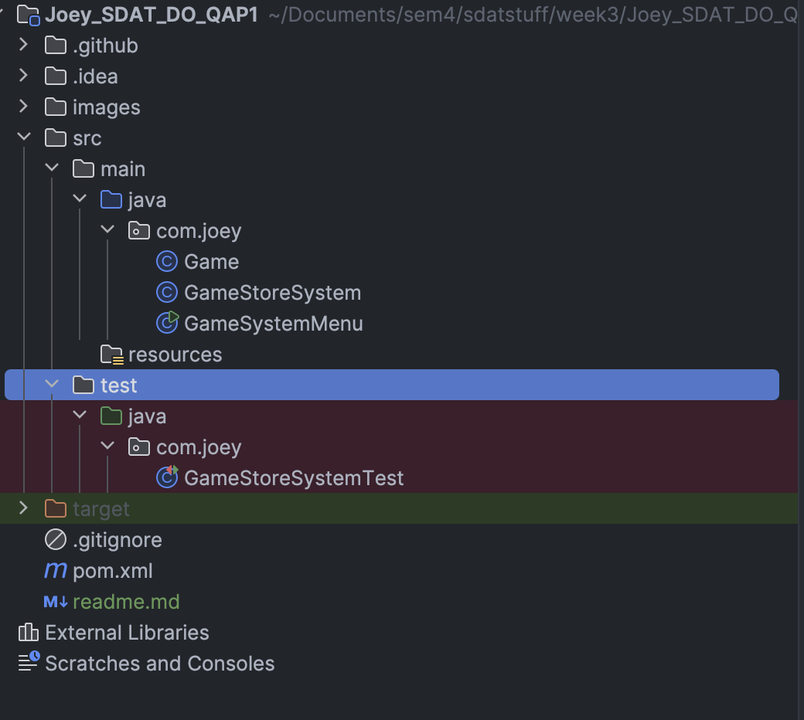
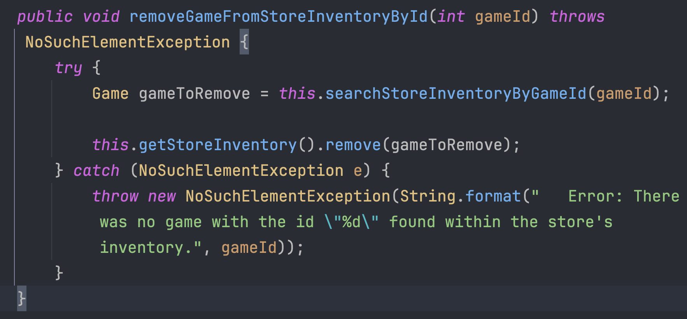
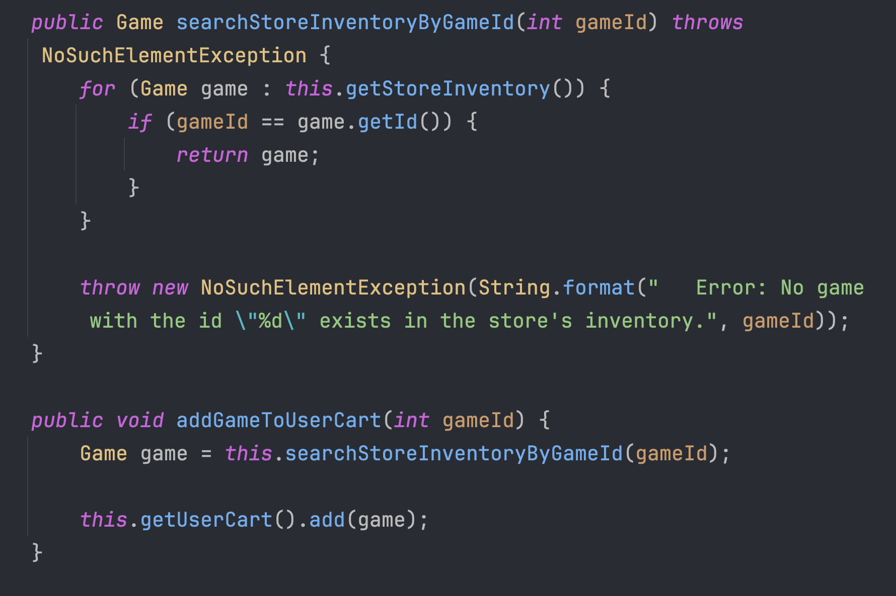

### Project Documentation 

#### "How does your code meet Clean Code practices?"
<ol>
<li>
<b>Project Structure</b>

By using conventional Java Maven project structure, understanding the project becomes that much easier. For instance, recreating the same directories inside the test area helps to build the association of what said test is testing.
</li>

  

<li>
<b>Intention-Revealing Names</b>

Each method call seen in this screenshot is self-explanatory in its name, allowing its purpose and role to be understood at a glance. "searchStoreInventoryByGameId" does indeed search through the StoreInventory for the game with the id specified by the parameter. "removeGameFromStoreInventoryById" follows the same naming convention to show their relationship as StoreInventory interaction methods.
</li>

  

<li>
<b>Function Indentation</b>

This image contains only one instance but the same remains true for each and every method across this project. That truth being to keep functions short, but I'm more specifically referring to the fact that one function should have a maximum of 2 indentation levels. Otherwise, things tend to look cluttered making it harder to read the code.
</li>
</ol>

  

#### "Explain your project: What it does. How it works. Explain the test cases you used."

<ul>
<li>
<b>What it does</b> - The program operates as a command-line interface storefront for a digital video game retailer called "<i>Joey's Game Emporium</i>". It supports adding/removing games to/from the StoreInventory, as well as adding/removing games to/from the user's shopping cart. Complete with a checkout function once you've added what you want to your cart.
</li>

  

<li>
<b>How it works</b> - Under the hood are three classes. The first of which is the Game class itself, it's nothing fancy; just some fields with getters/setters along with an overridden toString method in order to improve appearance in the console for the storefront's listings.

  

The second class is GameStoreSystem. If you look at the Game class like the product the store is selling, then GameStoreSystem is the actual store. It contains methods for both of the aforementioned adding/removing to/from cart/StoreInventory functionalities in the <b>What it does</b> section. Methods for searching the StoreInventory for a Game by its id field, and for checkout are also included in this class.

  

Finally, the third class is GameStoreMenu. Although, it is less of a class and more of the menu from which you interact with the store from the console. This was originally planned to be in the same file as GameStoreSystem, but I realized that splitting them into their own files makes them a lot nicer to read. This class is a main method mostly comprised of "System.out.println" and its variations. But within it also dwells a monster of a switch statement, the purpose of the beast is controlling the flow of the menu as the user makes their choices. Speaking of the user making their choices, each input (Aside from the menu choice because the switch's default case takes care of that) is wrapped within a while loop for input validation, another purpose of this is to reduce the pain of being sent to the menu upon an invalid input.
</li>

  

<li>
<b>The test cases I used</b> - The only class to have testing is GameStoreSystem. This is because the Game class only contains getters/setters which are redundant to test, and testing the GameStoreMenu would require mocking a Scanner which is currently not something I can perform. Other than that, every one of GameStoreSystem's methods (excluding the getters/setters) has at least one test scenario created for it. I also included tests for error handling by ensuring certain methods throw the expected exceptions under the right conditions.
</li>
</ul>

  

#### "Outline the dependencies. Where did you get them from?"

Just one dependency was used in this project as is visible in the pom.xml file. That of course is JUnit, which is the framework used for all the tests written in GameStoreSystemTest. I acquired this dependency from [Maven Repository](https://mvnrepository.com/).